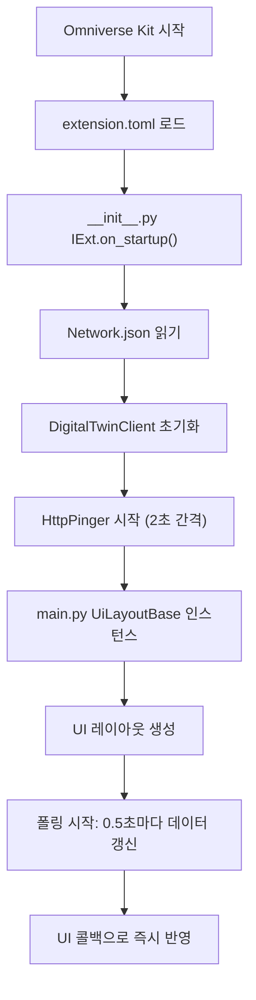

# Platform Extension (Omniverse UI) - 인수인계 문서

## 📋 프로젝트 개요

**프로젝트명:** Platform Extension for Omniverse  
**목적:** Omniverse Kit 기반 AMR(자율주행로봇) 디지털 트윈 UI 시스템  
**주요 기능:** 실시간 AMR 제어, 컨테이너 관리, 미션 모니터링, 경로 계획 시각화  
**개발 언어:** Python (Omniverse Kit API 기반)  
**개발 환경:** Omniverse Kit 107.3+

---

## 📁 폴더 구조

```
c:\omniverse_exts\
├── AMR.usd                           # 3D 모델 (AMR 프로토타입)
├── KMP_600i.fbx                      # 로봇 모델 파일
├── .idea/                            # IDE 설정
├── .thumbs/                          # 캐시
│
└── platform_ext/                     # 📌 메인 확장 모듈
    ├── .git/                         # 버전 관리
    ├── extension.toml                # 🔧 확장 설정 파일 (의존성, 버전)
    ├── README.md                     # 프로젝트 문서
    ├── SHA256                        # 체크섬
    │
    ├── config/
    │   └── Network.json              # 🔌 서버 연결 설정 (IP, 포트, mapCode)
    │
    ├── fonts/
    │   ├── OFL.txt / README.txt       # 라이선스
    │   └── static/                   # 한글 폰트 (NotoSansKR)
    │
    ├── PNG/                          # 리소스 이미지
    │
    ├── resource/
    │   └── map_*.json                # 맵 데이터 (경로 계획용)
    │
    └── ui_code/                      # 🎨 핵심 코드
        ├── __init__.py               # 🚀 메인 진입점 (IExt, HTTP 핑어)
        ├── main.py                   # UI 레이아웃 및 라이프사이클
        ├── client.py                 # REST API 클라이언트
        │
        ├── AMR/                      # AMR 관제 기능
        │   ├── amr_control_panel.py  # ✅ AMR 제어 패널 (이동, 정지, 취소 명령)
        │   ├── amr_details_panel.py  # 📊 AMR 상세 정보 (배터리, 상태, 위치)
        │   └── amr_pathfinder_panel.py # 🗺️ 경로 계획 미니맵 (마우스 상호작용)
        │
        ├── Chatbot/
        │   └── chatbot_panel.py      # 💬 챗봇 패널 (LLM 통합, SSE 알림)
        │
        ├── Container/
        │   └── container_list_panel.py # 📦 컨테이너 목록 (필터링, 상태 조회)
        │
        ├── Mission/
        │   └── mission_panel.py      # ✈️ 미션 모니터링 (working/waiting/reserved)
        │
        └── ui/                       # UI 컴포넌트 계층 구조
            ├── components/
            │   └── amr_card.py       # 🎴 AMR 카드 컴포넌트 (재사용 UI)
            │
            ├── scene/
            │   ├── amr_3d.py         # 🎭 3D 렌더링 (USD/Omniverse 기반 로봇 표시)
            │   └── linecar.py        # 🚗 라인카 모델 (색상 매핑, 재료 바인딩)
            │
            ├── sections/
            │   ├── top_bar.py        # 🔝 상단 메뉴바 (로고, 온습도 표시)
            │   ├── amr_panel.py      # 📱 AMR 목록 패널
            │   ├── status_panel.py   # 📈 상태 패널 (도넛 차트, 통계)
            │   ├── bottom_bar.py     # 🔽 하단 제어 바 (버튼: AMR 제어, 챗봇 등)
            │   └── body_data_panel.py # 🏭 바디라인 데이터 패널
            │
            └── utils/
                └── common.py         # 🛠️ 공용 유틸 (색상, 포맷, 경로 헬퍼)
```

---

## 🔧 핵심 파일 설명

### 1️⃣ **`__init__.py`** (확장 진입점)
- **역할:** Omniverse Kit의 IExt 인터페이스 구현
- **핵심 기능:**
  - HTTP Pinger 클래스로 서버 상태 모니터링
  - 네트워크 연결 감지 (`on_change` 콜백)
  - UI 업데이트 큐 (thread-safe 작업 처리)
  - AMR 실시간 로깅
- **주요 클래스:**
  - `HttpPinger`: 서버 상태 감지 (핑 기반, 2초 간격)
  - `PlatformExtension`: IExt 구현체

### 2️⃣ **`main.py`** (UI 레이아웃)
- **역할:** 전체 UI 구조 정의 및 라이프사이클 관리
- **핵심 기능:**
  - 윈도우 레이아웃 (상단/중간/하단 바)
  - 메뉴바/비뷰포트 메뉴 숨기기
  - 데이터 모델 관리 (AMR, 컨테이너, 미션 통계)
  - 실시간 UI 동기화
- **주요 클래스:**
  - `UiLayoutBase`: 모든 UI 컴포넌트 호스팅

### 3️⃣ **`client.py`** (REST API 클라이언트)
- **역할:** 백엔드 서버와 통신
- **핵심 기능:**
  - Network.json에서 설정 로드 (IP, 포트, mapCode)
  - 주기적 폴링 (0.5초 간격)
  - 콜백 기반 이벤트 시스템 (on_alive_change, on_request, on_response, on_error)
  - 자동 재연결
- **API 데이터 타입:**
  - `ConnectionInfo` / `AMRInfo` / `ContainerInfo` / `WorkingInfo` / `MissionInfo` / `ReservationInfo` / `OPCConnectionControl`

### 4️⃣ **`amr_control_panel.py`** (AMR 제어)
- **역할:** 로봇 선택 및 명령 전송
- **핵심 기능:**
  - 콤보박스로 AMR 선택
  - 명령 선택 (Move, Rack Move, Pause, Resume, Cancel)
  - 파라미터 입력 (컨테이너, 노드, 미션 코드)
  - 실시간 AMR 리스트 갱신
- **전송 데이터:** dataType 매핑 (`ManualMove`, `AMRPause` 등)

### 5️⃣ **`amr_details_panel.py`** (AMR 상세 정보)
- **역할:** 선택된 AMR의 상세 정보 표시
- **표시 항목:**
  - 상태 (IDLE/INTASK/CHARGING/EXCEPTION)
  - 배터리 (프로그레스바)
  - Lift 상태 (Up/Down)
  - 현재 미션 코드
  - 로봇 사진

### 6️⃣ **`amr_pathfinder_panel.py`** (경로 계획 미니맵)
- **역할:** 맵 시각화 및 로봇 위치 표시
- **핵심 기능:**
  - 맵 JSON 로드 (노드/엣지)
  - 실시간 로봇 위치 업데이트
  - 마우스 휠 확대/축소 (커서 기준)
  - 좌클릭 드래그 팬(이동)
  - mm → m 자동 변환
- **좌표계:** X: 0~120, Y: -80~40 (월드 좌표)

### 7️⃣ **`chatbot_panel.py`** (챗봇)
- **역할:** LLM 기반 챗봇 UI + 실시간 알림
- **핵심 기능:**
  - Django 백엔드와 통신
  - SSE(Server-Sent Events) 알림 스트림
  - 태그 기반 알림 분류 (LOW, OFFLINE, FAULT, WARN)
  - "Reconnect Alerts" 버튼

### 8️⃣ **`container_list_panel.py`** (컨테이너 목록)
- **역할:** 컨테이너 상태 조회 및 필터링
- **핵심 기능:**
  - 모델 필터 (All, LR, LF, AR, AC, AF, P)
  - 상태 필터 (All, On Map, Off Map)
  - 즉시 적용 (콤보박스 변경 시)
  - 컨테이너 카드 렌더링

### 9️⃣ **`mission_panel.py`** (미션 모니터링)
- **역할:** 미션 상태 표시 및 취소 기능
- **표시 항목:**
  - Working (진행 중) - 주황색
  - Waiting (대기 중) - 파란색
  - Reserved (예약됨) - 초록색
- **기능:** Cancel 버튼으로 미션 취소, Reset All로 초기화

### 🔟 **`amr_3d.py`** (3D 렌더링)
- **역할:** USD/Omniverse 기반 로봇 3D 표시
- **핵심 기능:**
  - 프로토타입 로드 (AMR.usd)
  - 실시간 위치/회전 업데이트 (부드러운 모션)
  - 좌표 변환 (mm → stage units)
  - 축 보정 (Z-up/Y-up 자동 감지)
- **파라미터:**
  - `_MOVE_SPEED_MM_S`: 이동 속도 (300 mm/s)
  - `_YAW_SPEED_DPS`: 회전 속도 (360 deg/s)

### 1️⃣1️⃣ **`linecar.py`** (라인카 모델)
- **역할:** 자동차 3D 모델 색상 지정 및 재료 바인딩
- **핵심 기능:**
  - 무작위 색상 할당 (검정, 파랑, 빨강, 흰색, 노랑)
  - OmniPBR / UsdPreviewSurface 머티리얼 수정
  - 특정 Look(재료) 타겟팅

### 1️⃣2️⃣ **`common.py`** (공용 유틸)
- **상태 포맷:**
  ```python
  1: "EXIT", 2: "OFFLINE", 3: "IDLE", 4: "INTASK",
  5: "CHARGING", 6: "UPDATING", 7: "EXCEPTION"
  ```
- **Lift 포맷:** `True/1 → "Up"`, `False/0 → "Down"`
- **경로 헬퍼:** ASSET_DIR 계산 (resource 폴더)

---

## 🔌 설정 파일

### **`Network.json`** (연결 설정)
```json
{
  "opServerIP": "127.0.0.1",
  "opServerPort": 49000,
  "https": false,
  "baseUrl": "http://127.0.0.1:49000/",
  "mapCode": "GBFTT"
}
```
- **ipServerIP/Port:** 백엔드 서버 주소
- **mapCode:** 맵 파일 선택 (`map_{code}_{code}_1pf.json`)

### **`extension.toml`** (확장 설정)
```toml
[package]
title = "Platform UI"
version = "1.0.0"
description = "Simple test extension for UI in Omniverse Kit"
category = "Custom"

[dependencies]
"omni.ui" = {}
"omni.kit.uiapp" = {}
"omni.kit.pipapi" = {}

[python.pipapi]
use_online_index = true
requirements = ["requests>=2.31,<3"]
modules = ["requests"]

[python]
[[python.module]]
name = "ui_code"

[[resources]]
name = "fonts"
path = "fonts"
```

---

## 🚀 실행 흐름



### 데이터 흐름
```
Server (Django/Backend)
    ↓
DigitalTwinClient (polls 0.5s)
    ↓
Callbacks (on_response, on_error)
    ↓
UI Queue (thread-safe)
    ↓
Omniverse UI (amr_card, status_panel, etc.)
```

---

## 🎯 주요 기능 정리

| 기능 | 파일 | 담당 클래스 | 설명 |
|------|------|-----------|------|
| **서버 연결** | `client.py` | DigitalTwinClient | REST API 폴링, 콜백 기반 이벤트 |
| **AMR 제어** | `amr_control_panel.py` | AMRControlPanel | 로봇 선택, 명령 전송 (Move/Pause/Resume/Cancel) |
| **AMR 정보** | `amr_details_panel.py` | AMRPanel | 배터리, 상태, 미션 표시 |
| **경로 계획** | `amr_pathfinder_panel.py` | PathFinderPanel | 미니맵, 로봇 위치 시각화 |
| **챗봇** | `chatbot_panel.py` | ChatbotPanel | LLM 통합, SSE 알림 |
| **컨테이너** | `container_list_panel.py` | ContainerPanel | 필터링, 상태 조회 |
| **미션** | `mission_panel.py` | MissionPanel | 상태 모니터링 (working/waiting/reserved) |
| **3D 렌더링** | `amr_3d.py` | Amr3D | 실시간 로봇 표시 |
| **색상 매핑** | `linecar.py` | (함수 기반) | 3D 모델 색상 지정 |

---

## 🔧 개발 가이드

### 새로운 패널 추가
1. `ui_code/{Module}/` 폴더 생성
2. 패널 클래스 작성 (예: `MyPanel`)
3. `show()`, `update()` 메서드 구현
4. `bottom_bar.py`에 버튼 추가
5. `main.py`에서 인스턴스 생성

### 서버 API 추가
1. `client.py`에서 메서드 추가
2. `__init__.py`에서 콜백 등록
3. UI에서 `self._client.method()` 호출

### 설정 값 수정
- **Network.json:** 서버 IP, 포트, mapCode
- **extension.toml:** 버전, 의존성
- **common.py:** 상태 맵, 포맷 함수

---

## ⚠️ 주의사항

1. **스레드 안전성:** UI 갱신은 반드시 `_ui_queue`를 통해 처리
2. **HTTP 타임아웃:** 기본 5초, 느린 서버는 `client.py`에서 조정
3. **좌표 변환:** mm ↔ m, 축 방향 (Z-up vs Y-up) 확인
4. **폰트:** NotoSansKR 미설치 시 시스템 폰트로 fallback
5. **메모리:** 3D 모델 로드 시 리소스 점검

---

## 📞 문의/버그 리포트

- **Config 오류:** Network.json 경로 확인 (`c:\omniverse_exts\platform_ext\config\`)
- **UI 안 보임:** Viewport 메뉴바 숨기기 제거 (extension.toml 확인)
- **API 연결 실패:** HttpPinger 로그 확인, 방화벽 설정 점검

---

## 📦 배포

```bash
# 확장 패킹
cd c:\omniverse_exts
# Omniverse Package Manager에서 platform_ext 폴더 선택 후 패킹
```

**버전:** 1.0.0  
**마지막 수정:** 2026년 2월 3일
